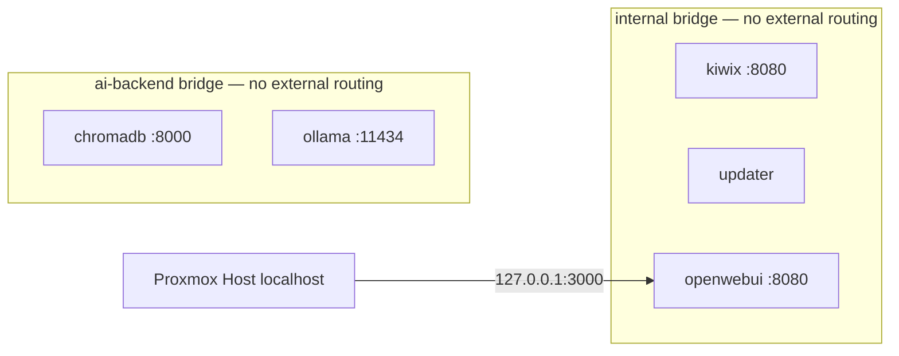
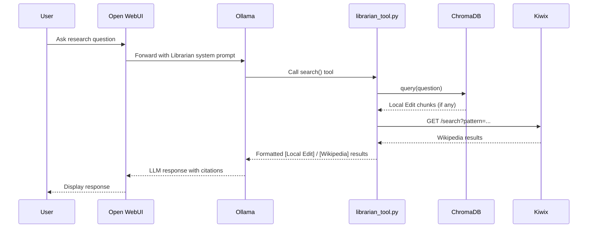
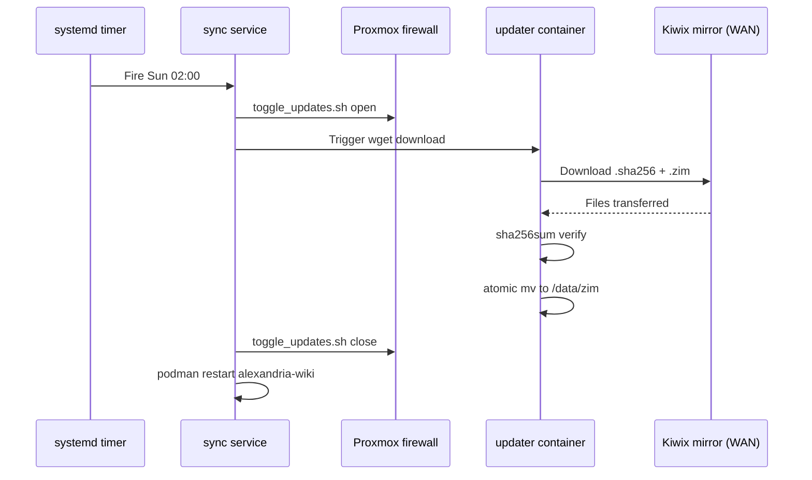

# Project Alexandria — Architecture Document
**Version:** 1.0.0 | **Author:** Iain Reid | **Date:** 2026-03-30

---

## 1. Overview

Project Alexandria delivers a secure, offline-first knowledge ecosystem on a single Proxmox 9.1 host. Five rootless Podman containers collaborate to serve the full English Wikipedia, a researcher-managed Markdown overlay, and an AI Research Librarian that queries both sources with local-edit priority.

## 2. System Context

```mermaid
graph TD
    U[User / Researcher] -->|HTTPS via reverse proxy| OW[Open WebUI :3000]
    OW -->|Ollama API| OL[Ollama LLM]
    OW -->|Librarian Tool| LT[librarian_tool.py]
    LT -->|Search API| KW[Kiwix :8080]
    LT -->|Vector query| CH[ChromaDB :8000]
    CH -->|Embeddings from| ED[/data/edits]
    KW -->|Serves| ZIM[/data/zim/*.zim]
    UP[Updater Sidecar] -->|Weekly wget| ZIM
    WAN[WAN / Internet] -.->|AC-4 gated Sun 02:00| UP
    SA[SysAdmin] -->|toggle_updates.sh| FW[Proxmox Firewall]
    FW -.->|allow/deny| WAN
```

## 3. Container Architecture

| Container | Image | Network | Role |
|:----------|:------|:--------|:-----|
| `alexandria-wiki` | `ghcr.io/kiwix/kiwix-serve:3.7.0` | internal | Wikipedia ZIM reader |
| `alexandria-sync` | `alpine:3.21.3` (custom) | internal | Weekly ZIM updater |
| `alexandria-chroma` | `chromadb/chroma:0.6.3` | ai-backend | Vector store (RAG) |
| `alexandria-ollama` | `ollama/ollama:0.6.5` | ai-backend | LLM inference |
| `alexandria-webui` | `ghcr.io/open-webui/open-webui:0.6.5` | internal + ai-backend | UI + orchestration |

### 3.1 Network Topology



Both bridges are `internal: true` — no container has a direct route to the host's external interface. Outbound internet access is exclusively through the Proxmox firewall WAN gate.

## 4. Data Flows

### 4.1 User Research Query



### 4.2 Weekly ZIM Sync



## 5. Security Architecture

| Control | Implementation |
|:--------|:--------------|
| Container isolation | `no-new-privileges`, all caps dropped, read-only root FS |
| Rootless execution | UID mapping 100000+ (CIS Level 2) |
| Secret management | `podman secret` — never in compose files or env vars |
| Network isolation | `internal: true` bridges, localhost-only WebUI bind |
| WAN gating | pve-firewall toggle, Sunday 02:00–04:00 window only |
| Integrity verification | sha256sum on every ZIM download and sneakernet import |
| Input validation | Query sanitisation regex in librarian_tool.py (OWASP A03) |
| Path traversal prevention | `_is_safe_path()` in ingest_edits.py |

## 6. Storage Layout

```
/mnt/pve/alexandria/          ← Proxmox storage pool (LUKS2/ZFS encrypted)
├── zim/                      ← ZIM archives (read-only mount into kiwix)
│   ├── wikipedia_en_all_maxi.zim   (~120 GB)
│   └── wikipedia_en_all_maxi.zim.sha256
├── edits/                    ← Local Markdown overlay (researcher-owned)
│   └── *.md
└── chromadb/                 ← ChromaDB vector store (persistent)
    └── chroma.sqlite3 + parquet segments
```

## 7. Dependency Versions (pinned)

| Component | Version | Source |
|:----------|:--------|:-------|
| kiwix-serve | 3.7.0 | ghcr.io/kiwix/kiwix-serve |
| Alpine | 3.21.3 | docker.io/library/alpine |
| chromadb | 0.6.3 | chromadb/chroma |
| ollama | 0.6.5 | ollama/ollama |
| open-webui | 0.6.5 | ghcr.io/open-webui/open-webui |
| sentence-transformers | 3.4.1 | PyPI |
| httpx | 0.28.1 | PyPI |
