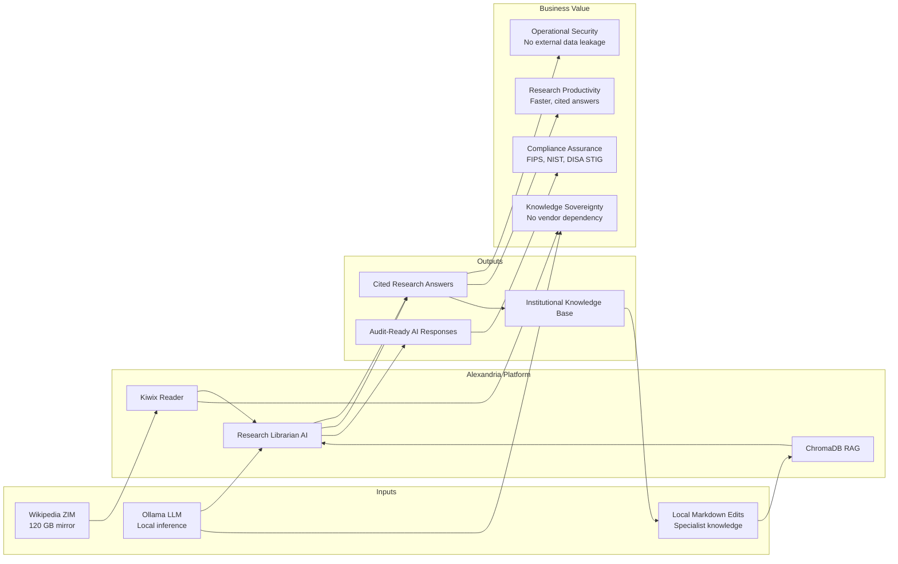

# Project Alexandria — Business Value Map (BVM)
**Version:** 1.0.0 | **Author:** Iain Reid | **Date:** 2026-03-30

---

## 1. Executive Summary

Project Alexandria delivers a sovereign, air-gappable knowledge platform that eliminates dependency on commercial search engines and cloud-hosted LLMs for research tasks. It provides measurable value across operational security, research productivity, compliance assurance, and institutional knowledge management.

---

## 2. Value Stream Map

---

## 3. Business Value Matrix

| Value Category | Capability Delivered | Measurable Outcome |
|:---------------|:---------------------|:-------------------|
| **Operational Security** | Air-gap compatible; no queries sent to internet | Zero external data exposure during research sessions |
| **Research Productivity** | Natural-language Q&A with citations in seconds | Reduction in time-to-answer vs. manual Wikipedia browsing |
| **Knowledge Sovereignty** | Local LLM + local knowledge base | No dependency on OpenAI, Google, or any cloud LLM provider |
| **Compliance Assurance** | FIPS 140-3, NIST SP 800-53, DISA STIG alignment | Audit-ready posture; security gap register maintained |
| **Institutional Memory** | Local Edit overlay persists team-specific knowledge | Specialist corrections and classified context survive staff turnover |
| **Information Integrity** | sha256 verification on all ZIM updates; Local Edit priority | Authoritative team knowledge overrides general Wikipedia |
| **Cost Efficiency** | No per-query API costs; no cloud storage fees | Zero ongoing AI API spend after initial hardware investment |
| **Resilience** | Weekly sync; sneakernet support; offline-first design | Continues operating during WAN outages or network restrictions |

---

## 4. Value by Stakeholder

| Stakeholder | Primary Value Received |
|:------------|:-----------------------|
| **Researcher** | Fast, cited, offline answers; ability to correct Wikipedia with local knowledge |
| **AI Architect** | Controllable, auditable AI stack; no hallucination from internet-connected models |
| **SysAdmin** | Hardened, compliant platform; automated sync; clear RBAC and maintenance procedures |
| **Organisation / CISO** | Sovereign AI; no data leaves the perimeter; compliance evidence available |

---

## 5. Return on Investment Indicators

| Indicator | Baseline (before Alexandria) | Target (with Alexandria) |
|:----------|:-----------------------------|:-------------------------|
| Research query time | 10–20 min (manual web search) | < 30 seconds (Librarian response) |
| External data exposure risk | High (commercial search/LLM) | Zero (fully local) |
| Compliance gaps (AI/data) | Uncontrolled | Documented and tracked |
| Institutional knowledge loss on staff change | High (informal) | Low (persisted in Local Edits) |

---

## 6. Risks to Value Delivery

| Risk | Impact | Mitigation |
|:-----|:-------|:-----------|
| ZIM file corruption | Research unavailable | Weekly sha256 verify; atomic replacement |
| Ollama model outdated | Degraded response quality | Quarterly model review |
| Local Edits not ingested after update | Stale RAG results | Ingest procedure documented; AI Architect responsible |
| WAN gate not closed after sync | Security exposure | Automated close via systemd post-exec; audit log |
