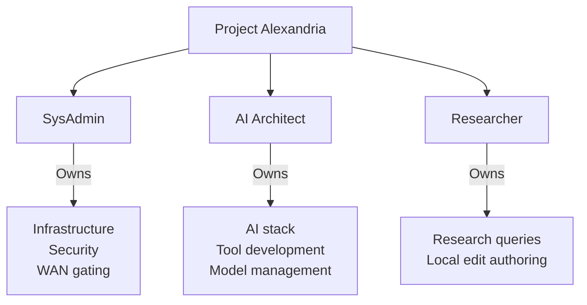
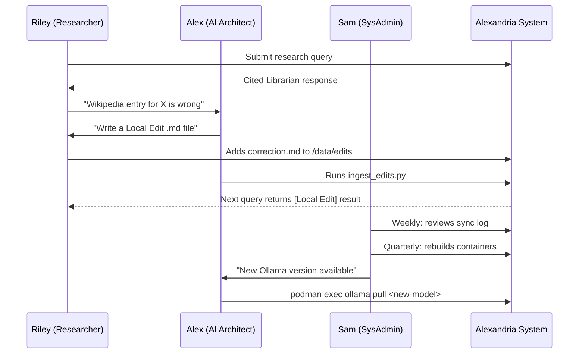

# Project Alexandria — Persona Definitions
**Version:** 1.0.0 | **Author:** Iain Reid | **Date:** 2026-03-30

---

## 1. Persona Overview

---

## 2. Persona Profiles

### 2.1 SysAdmin — "Sam"

| Attribute | Detail |
|:----------|:-------|
| **Role** | Proxmox Infrastructure Administrator |
| **Technical level** | Expert — Linux, Proxmox, networking, Podman |
| **Primary goal** | Keep the platform secure, compliant, and available |
| **Secondary goal** | Minimise maintenance burden through automation |
| **Frustrations** | Undocumented changes; uncontrolled WAN access; audit failures |
| **Tools used daily** | SSH, Proxmox Web UI, systemctl, journalctl, podman |

**Key tasks:**
- Manages container lifecycle and storage pool
- Controls WAN gate (only role permitted to open it)
- Responds to security incidents
- Performs quarterly rebuilds and secret rotation
- Reviews audit logs

**Pain points Alexandria addresses:**
- Automated WAN gating with full audit trail removes manual firewall management
- Systemd timer automation removes the need for manual sync scheduling
- Hardened containers with documented security posture simplify compliance evidence

---

### 2.2 AI Architect — "Alex"

| Attribute | Detail |
|:----------|:-------|
| **Role** | AI Integration Engineer / Data Scientist |
| **Technical level** | Advanced — Python, LLMs, RAG, vector databases, Open WebUI |
| **Primary goal** | Ensure the Librarian delivers accurate, cited, hallucination-free responses |
| **Secondary goal** | Continuously improve RAG retrieval quality |
| **Frustrations** | Black-box AI responses; uncheckable hallucinations; model vendor lock-in |
| **Tools used daily** | Open WebUI admin panel, Python, Ollama CLI, ChromaDB API |

**Key tasks:**
- Registers and updates the Librarian tool in Open WebUI
- Manages Ollama model pulls and system prompt tuning
- Runs monthly hallucination / persona audits
- Manages ChromaDB collections and ingest pipeline
- Develops and maintains `librarian_tool.py` and `ingest_edits.py`

**Pain points Alexandria addresses:**
- Fully observable AI stack — no external API calls, full log access
- Local-Edit priority rule (FR-7) gives direct control over LLM factual grounding
- Hallucination guard string provides deterministic fallback behaviour

---

### 2.3 Researcher — "Riley"

| Attribute | Detail |
|:----------|:-------|
| **Role** | Subject Matter Expert / Analyst |
| **Technical level** | Moderate — comfortable with browser tools; not a developer |
| **Primary goal** | Get accurate, cited answers to research questions quickly |
| **Secondary goal** | Correct or supplement Wikipedia with specialist knowledge |
| **Frustrations** | Uncited AI answers; internet-connected tools leaking sensitive queries; slow manual research |
| **Tools used daily** | Web browser (Open WebUI), text editor (for Markdown edits) |

**Key tasks:**
- Submits natural-language queries to the Alexandria Librarian
- Writes Markdown Local Edits when Wikipedia is incorrect or insufficient
- Uses citation prefixes (`[Local Edit]` / `[Wikipedia]`) to evaluate source authority

**Pain points Alexandria addresses:**
- Citations on every response eliminate guessing whether the AI is hallucinating
- Local Edit priority means subject-matter corrections are authoritative immediately
- Offline-first design means queries never leave the organisation's perimeter

---

## 3. Persona Interaction Map

---

## 4. Out-of-Scope Personas

The following personas were considered and explicitly excluded from v1.0:

| Persona | Reason excluded |
|:--------|:----------------|
| **Anonymous / unauthenticated user** | Open WebUI requires login; no public access |
| **External auditor** | Supported by documentation suite only; no direct system access |
| **Automated agent / CI pipeline** | No API access exposed externally in v1.0 |
